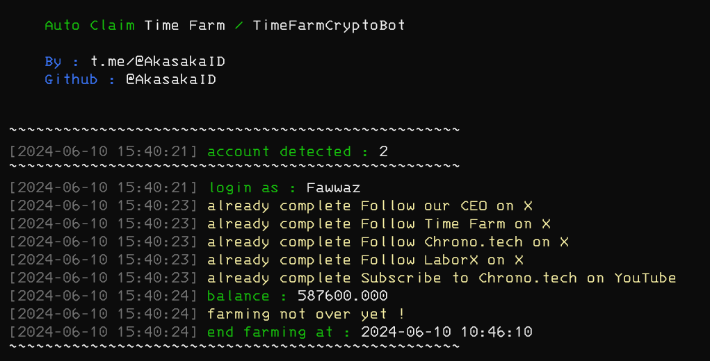

# TimeFarmTod

Auto claim for time farm telegram bot

<center>

</center>

# Table of Contens

- [TimeFarmTod](#timefarmtod)
- [Table of Contens](#table-of-contens)
- [Features](#features)
- [Register](#register)
- [How to Use](#how-to-use)
  - [Windows](#windows)
  - [Linux](#linux)
  - [Termux](#termux)
- [How to Get Data](#how-to-get-data)
- [Discussion](#discussion)
- [Support](#support)
- [Thank you \< 3](#thank-you--3)

# Features

- [x] Auto Claim
- [x] Auto Complete Task (exclude telegram task)
- [x] Support Multi Account
- [x] no login require

# Register 

Click the following link for register : https://t.me/TimeFarmCryptoBot?start=aL10AOUuixNmozwN

# How to Use

## Windows 

1. Make sure you computer was installed python and git.
   
   python site : [https://python.org](https://python.org)
   
   git site : [https://git-scm.com/](https://git-scm.com/)

2. Clone this repository
   ```shell
   git clone https://github.com/KayNguyen97/TimeFarm.git
   ```

3. goto timefarmtod directory
   ```
   cd timefarmtod
   ```

4. install the require library
   ```
   python -m pip install -r requirements.txt
   ```

5. fill the `data.txt` file with your data, how to get data you can refer to [How to Get Data](#how-to-get-data)
6. execute the main program 
   ```
   python bot.py
   ```

## Linux

1. Make sure you computer was installed python and git.
   
   python
   ```shell
   sudo apt install python3 python3-pip
   ```
   git
   ```shell
   sudo apt install git
   ```

2. Clone this repository
   
   ```shell
   git clone https://github.com/KayNguyen97/TimeFarm.git
   ```

3. goto timefarmtod directory

   ```shell
   cd timefarmtod
   ```

4. Install the require library
   
   ```
   python3 -m pip install -r requirements.txt
   ```

5. fill the `data.txt` file with your data, how to get data you can refer to [How to Get Data](#how-to-get-data)
6. execute the main program 
   ```
   python bot.py
   ```

## Termux

1. Make sure you termux was installed python and git.
   
   python
   ```
   pkg install python
   ```

   git
   ```
   pkg install git
   ```

2. Clone this repository
   ```shell
   git clone https://github.com/KayNguyen97/TimeFarm.git
   ```

3. goto timefarmtod directory
   ```
   cd timefarmtod
   ```

4. install the require library
   ```
   python -m pip install -r requirements.txt
   ```

5. fill the `data.txt` file with your data, how to get data you can refer to [How to Get Data](#how-to-get-data)
6. execute the main program 
   ```
   python bot.py
   ```

# How to Get Data


Example of data needed

```
query_id=xxxxxxxxxx&user=xxxxxxfirst_namexxxxxlast_namexxxxxxxusernamexxxxxxxlanguage_codexxxxxxxallows_write_to_pmxxxxxxx&auth_date=xxxxxx&hash=xxxxxxxxxxxxxxxxxxxxx
```

If you want to add more account than this is how

```
query_id=xxxxxxxxxx&user=xxxxxxfirst_namexxxxxlast_namexxxxxxxusernamexxxxxxxlanguage_codexxxxxxxallows_write_to_pmxxxxxxx&auth_date=xxxxxx&hash=xxxxxxxxxxxxxxxxxxxxx
query_id=xxxxxxxxxx&user=xxxxxxfirst_namexxxxxlast_namexxxxxxxusernamexxxxxxxlanguage_codexxxxxxxallows_write_to_pmxxxxxxx&auth_date=xxxxxx&hash=xxxxxxxxxxxxxxxxxxxxx
```

# Thank you < 3